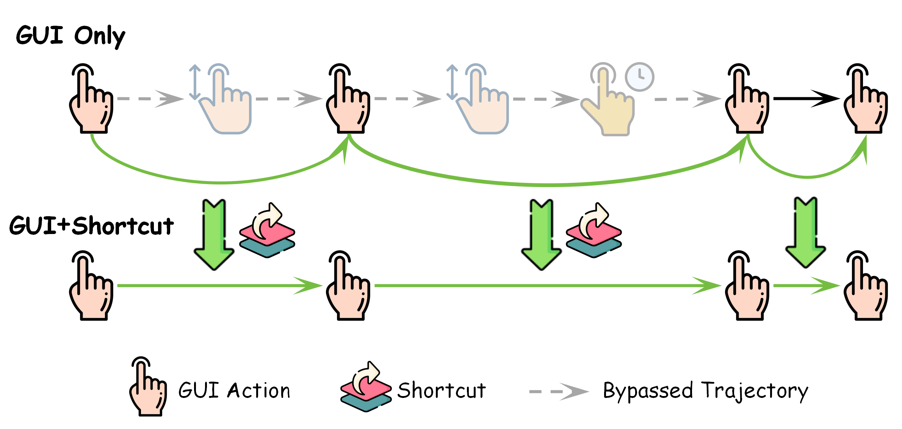
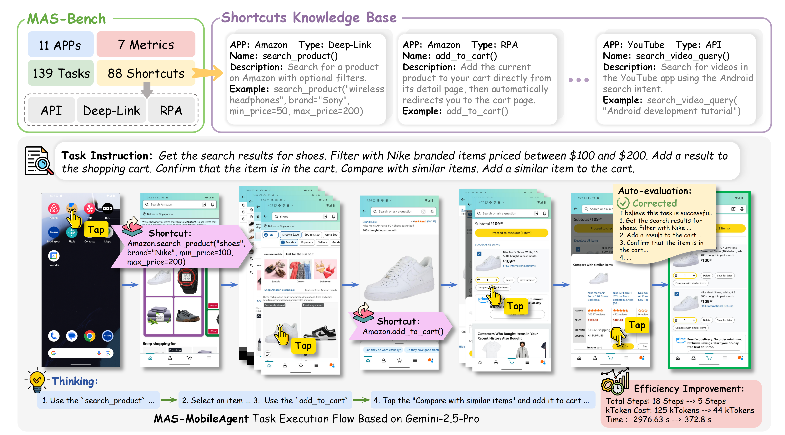
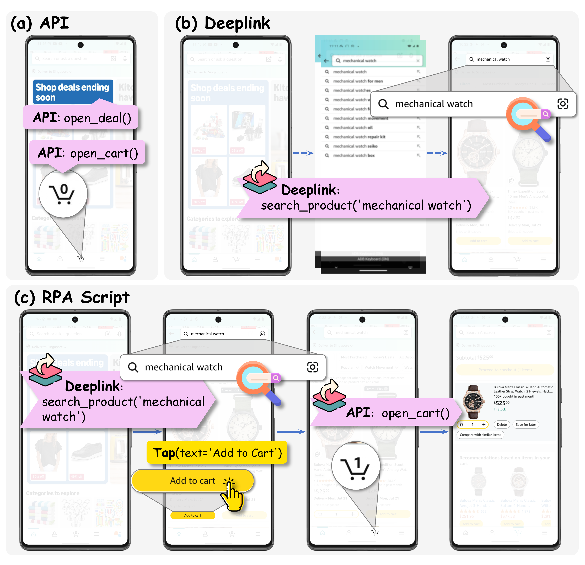
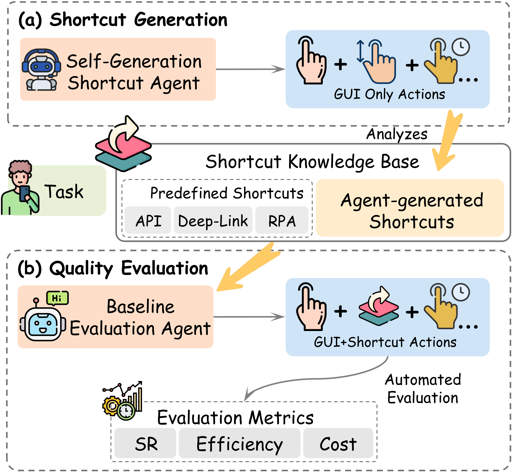

# MAS-Bench: A Unified Benchmark for Shortcut-Augmented Hybrid Mobile GUI Agents

**[Project Page](https://pengxiang-zhao.github.io/MAS-Bench/)**

## Overview

### GUI-Only vs. GUI-shortcut Hybrid Agent Workflow


### MAS-Bench Pipeline


### Predefined Shortcuts


### Shortcut Generation Evaluation


## Abstract

To enhance the efficiency of GUI agents on various platforms like smartphones and computers, a hybrid paradigm that combines flexible GUI operations with efficient shortcuts (e.g., API, deep links) is emerging as a promising direction. However, a framework for systematically benchmarking these hybrid agents is still underexplored. To take the first step in bridging this gap, we introduce **MAS-Bench**, a benchmark that pioneers the evaluation of GUI-shortcut hybrid agents with a specific focus on the mobile domain. Beyond merely using predefined shortcuts, MAS-Bench assesses an agent's capability to *autonomously generate* shortcuts by discovering and creating reusable, low-cost workflows. It features 139 complex tasks across 11 real-world applications, a knowledge base of 88 predefined shortcuts (APIs, deep-links, RPA scripts), and 7 evaluation metrics. The tasks are designed to be solvable via GUI-only operations, but can be significantly accelerated by intelligently embedding shortcuts. Experiments show that hybrid agents achieve significantly higher success rates and efficiency than their GUI-only counterparts. This result also demonstrates the effectiveness of our method for evaluating an agent's shortcut generation capabilities. MAS-Bench fills a critical evaluation gap, providing a foundational platform for future advancements in creating more efficient and robust intelligent agents.

## Key Contributions

- **Comprehensive Benchmark**: We introduce MAS-Bench, the first benchmark for systematically evaluating GUI-shortcut hybrid mobile agents, featuring 139 tasks, 11 apps, 88 predefined shortcuts, and 7 evaluation metrics.
- **Hybrid Agent Baselines**: We show that hybrid agents on MAS-Bench significantly outperform GUI-only counterparts in both success rate and efficiency.
- **Shortcut Generation Evaluation**: We propose the first framework to evaluate an agent's ability to generate new shortcuts, revealing a key research gap between the performance of predefined and agent-generated shortcuts.


## Code (Under Updating)


## Citation

If you find our work useful, please consider citing our paper:

```bibtex
@misc{zhao2025masbench,
      title={MAS-Bench: A Unified Benchmark for Shortcut-Augmented Hybrid Mobile GUI Agents}, 
      author={Pengxiang Zhao and Guangyi Liu and Yaozhen Liang and Weiqing He and Zhengxi Lu and Yuehao Huang and Yaxuan Guo and Kexin Zhang and Hao Wang and Liang Liu and Yong Liu},
      year={2025},
      eprint={2509.06477},
      archivePrefix={arXiv},
      primaryClass={cs.AI},
      url={https://arxiv.org/abs/2509.06477}, 
}
```


