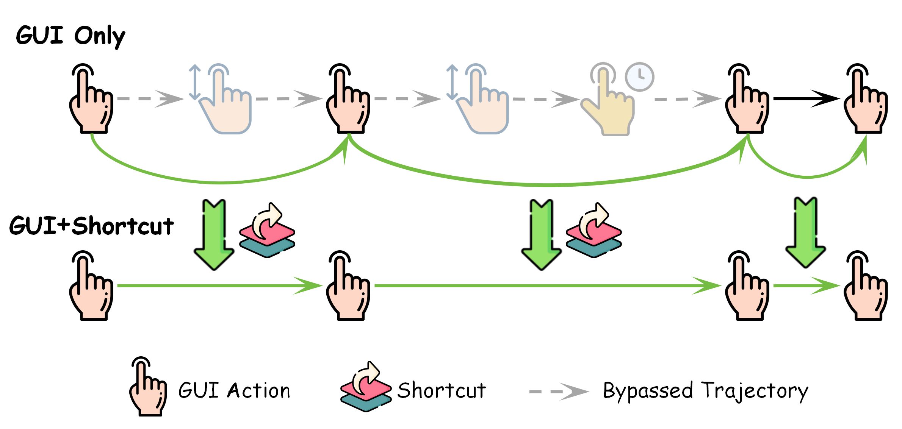
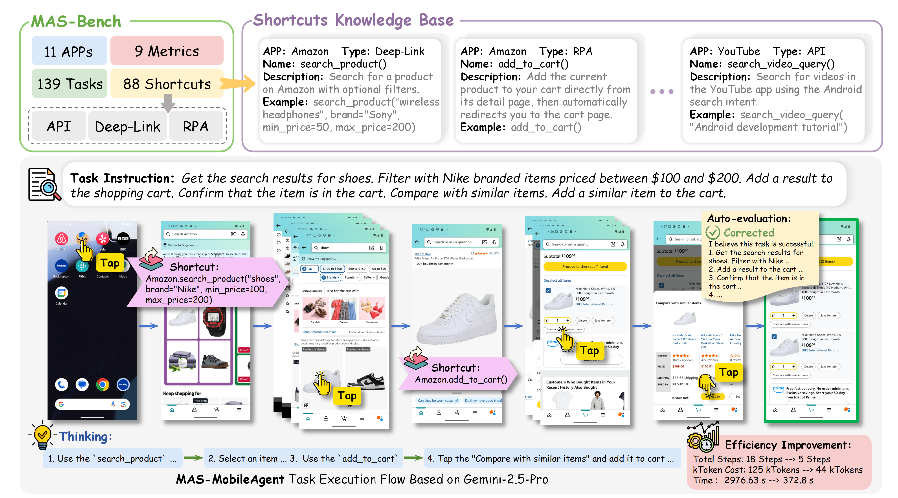
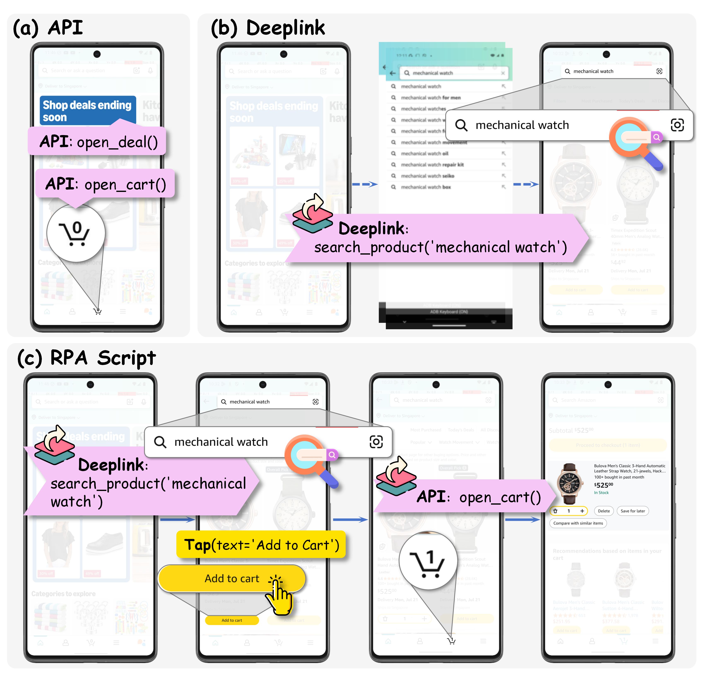
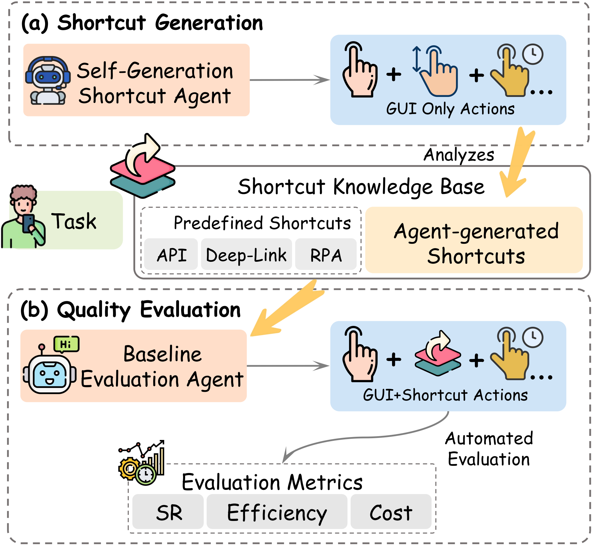

# MAS-Bench: A Unified Benchmark for Shortcut-Augmented Hybrid Mobile GUI Agents

<div align="center">
  <a href="https://arxiv.org/abs/2509.06477"></a>
  
  <a href="https://pengxiang-zhao.github.io/MAS-Bench/"></a>
  <a href="https://github.com/Pengxiang-zhao/MAS-Bench/stargazers"></a>
</div>

## News

- MAS-Bench has been accepted to ACL 2026. The code, benchmark environment, and evaluation resources will be open-sourced soon.

## Overview

### GUI-Only vs. GUI-shortcut Hybrid Agent Workflow


### MAS-Bench Pipeline


### Predefined Shortcuts


### Shortcut Generation Evaluation


## Abstract

Shortcuts such as APIs and deep-links have emerged as efficient complements to flexible GUI operations, fostering a promising hybrid paradigm for MLLM-based mobile automation. However, systematic evaluation of GUI-shortcut hybrid agents remains largely underexplored. To bridge this gap, we introduce **MAS-Bench**, a benchmark that pioneers the evaluation of GUI-shortcut hybrid agents with a specific focus on the mobile domain. Beyond merely using predefined shortcuts, MAS-Bench assesses an agent's capability to *autonomously generate* shortcuts by discovering and creating reusable, low-cost workflows. It features 139 complex tasks across 11 real-world applications, a knowledge base of 88 predefined shortcuts (APIs, deep-links, RPA scripts), and 9 evaluation metrics. Experiments demonstrate that hybrid agents achieve up to 68.3% success rate and 39% greater execution efficiency than GUI-only counterparts. Furthermore, our evaluation framework effectively reveals the quality gap between predefined and agent-generated shortcuts, validating its capability to assess shortcut generation methods. MAS-Bench addresses the lack of systematic benchmarks for GUI-shortcut hybrid mobile agents, providing a foundational platform for future advancements in creating more efficient and robust intelligent agents.

## Key Contributions

- **Comprehensive Benchmark**: We introduce MAS-Bench, the first benchmark for systematically evaluating GUI-shortcut hybrid mobile agents, featuring 139 complex tasks, 11 real-world apps, 88 predefined shortcuts, and 9 evaluation metrics.
- **Hybrid Agent Baselines**: We establish extensive baselines across agentic workflows, general-purpose models, and specialized GUI models, demonstrating that GUI-shortcut hybrid operation substantially improves success rate and efficiency while exposing shortcut misuse.
- **Shortcut Generation Evaluation**: We propose the first framework to evaluate an agent's ability to generate shortcuts from interaction trajectories, revealing that current generated shortcuts still lag behind predefined ones in efficiency and robustness.


## Code

MAS-Bench has been accepted to ACL 2026. The code, benchmark environment, and evaluation resources will be open-sourced soon.


## Citation

If you find our work useful, please consider citing our paper:

```bibtex
@misc{zhao2025masbench,
      title={MAS-Bench: A Unified Benchmark for Shortcut-Augmented Hybrid Mobile GUI Agents}, 
      author={Pengxiang Zhao and Guangyi Liu and YaoZhen Liang and Weiqing He and Zhengxi Lu and WenHao Wang and Yuehao Huang and Yuxiang Chai and Zhaolu Kang and Yaxuan Guo and Hao Wang and Kexin Zhang and Liang Liu and Yong Liu},
      year={2025},
      eprint={2509.06477},
      archivePrefix={arXiv},
      primaryClass={cs.AI},
      url={https://arxiv.org/abs/2509.06477}, 
}
```

